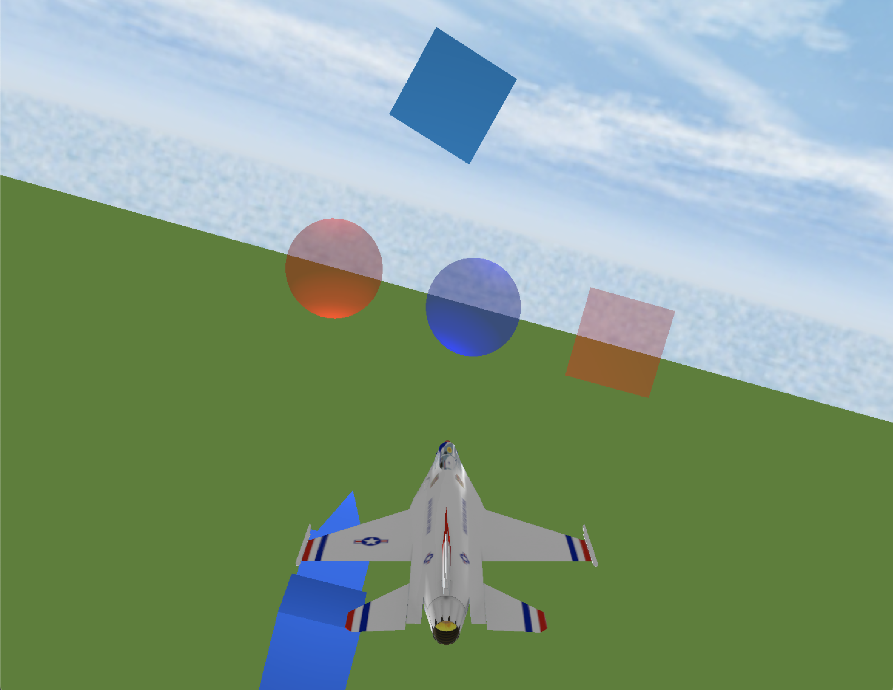

# ToyFlightSimulator
Toy Flight Simulator implemented with Swift and Metal

1/8/2023 - Very early stage, just implemented Order Independent Transparency with the help of [Apple's tutorial](https://developer.apple.com/documentation/metal/metal_sample_code_library/implementing_order-independent_transparency_with_image_blocks)

