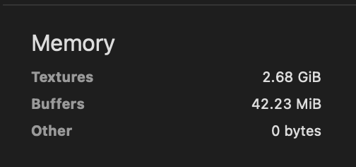
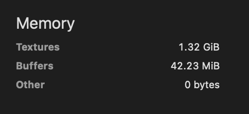
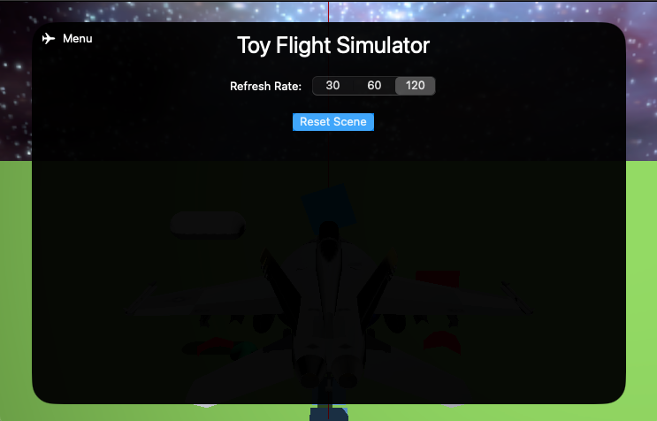

# ToyFlightSimulator

### Toy Flight Simulator implemented with Swift, SwiftUI and Metal

## Devlog

7/21/24 - First attempt at afterburner using particle effects.

[Toy Flight Sim 7-21-24 Afterburner Particle Effect (YouTube demo)](https://www.youtube.com/watch?v=6hNesEF7Tbk)

---

1/3/24 - Lowered Texture memory usage by ~50% by using a cache.

Before caching textures:

After caching textures:

Also, app now has a simple menu implemented in SwiftUI, accessible by pressing Escape on Mac or by swiping down from the top in iOS:

---

7/20/23 - Hack to implement "skeletal animation" / movement of control surfaces by moving submeshes.

[Toy Flight Sim 7-20-23 (YouTube demo)](https://www.youtube.com/watch?v=eXpibhLOVw8)

---

5/31/2023 - Aircraft rotations (pitch, roll, yaw) stabilized, implemented firing missiles and dropping bombs.

[Toy Flight Sim 5-31-23 (YouTube demo)](https://www.youtube.com/watch?v=CXxXFoxoLWA)

---

4/9/2023 - Figured out how to independently render submeshes from F-18 OBJ model (AIM-9 & AIM-120 missles displayed):

---

2/26/2023 - Implemented Skybox stage of Single-Pass Deferred Lighting Renderer; using new F/A-18F fighter jet model.

---

2/10/2023 - Implemented Shadow, GBuffer and Directional Lighting stages of Single-Pass Deferred Lighting Renderer, using Apple's [Rendering a Scene with Deferred Lighting in Swift example](https://developer.apple.com/documentation/metal/metal_sample_code_library/rendering_a_scene_with_deferred_lighting_in_swift)

---

1/16/2023 - Tried implementing shadows (in shadow branch) - inspired by [Warrren Moore's shadow tutorial](https://medium.com/@warrenm/thirty-days-of-metal-day-19-directional-shadows-116cecbafcbb) and [2etime's shadow example](https://discord.com/channels/428977382515277824/428977382515277830/1059718599398404116)

---

1/8/2023 - Very early stage, just implemented Order Independent Transparency with the help of [Apple's tutorial](https://developer.apple.com/documentation/metal/metal_sample_code_library/implementing_order-independent_transparency_with_image_blocks)

